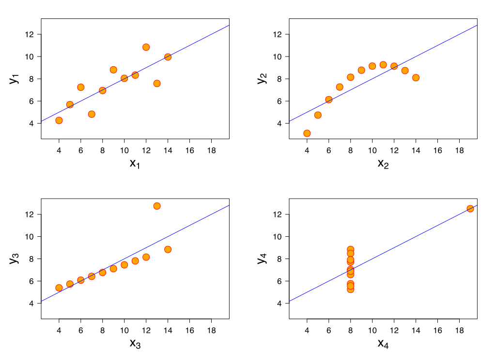
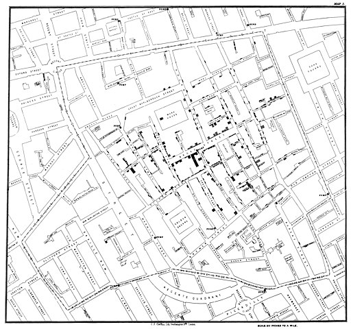

# The Memory Machine

> José Arcadio Buendía then decided to build the memory machine that he had desired once in order to remember the marvelous inventions of the gypsies. The artifact was based on the possibility of reviewing every morning, from beginning to end, the totality of knowledge acquired during one’s life. He conceived of it as a spinning dictionary that a person placed on the axis could operate by means of a lever, so that in a very few hours there would pass before his eyes the notions most necessary for life.
> Gabriel García Márquez - One Hundred Years of Solitude

**A cheatsheet combined with notes, examples, and links to various resources.**

[@enerdemdemir](https://twitter.com/enerdemdemir)

## Contents

**Visualisation**

> [`Books`](#visualisation-books)

## Visualisation books

1. Tufte Edward R. - The Visual Display of Quantitative Information (2ed)

### The Visual Display of Quantitative Information

**Anscombe's quartet**

Anscombe's quartet comprises four data sets that have nearly identical simple descriptive statistics, yet have very different distributions and appear very different when graphed. 

| x1   | y1    | x2   | y2   | x3   | y3    | x4   | y4   |
| ---- | ----- | ---- | ---- | ---- | ----- | ---- | ---- |
| 10   | 8.04  | 10   | 9.14 | 10   | 7.46  | 8    | 6.58 |
| 8    | 6.95  | 8    | 8.14 | 8    | 6.77  | 8    | 5.76 |
| 13   | 7.58  | 13   | 8.74 | 13   | 12.74 | 8    | 7.71 |
| 9    | 8.81  | 9    | 8.77 | 9    | 7.11  | 8    | 8.84 |
| 11   | 8.33  | 11   | 9.26 | 11   | 7.81  | 8    | 8.47 |
| 14   | 9.96  | 14   | 8.1  | 14   | 8.84  | 8    | 7.04 |
| 6    | 7.24  | 6    | 6.13 | 6    | 6.08  | 8    | 5.25 |
| 4    | 4.26  | 4    | 3.1  | 4    | 5.39  | 19   | 12.5 |
| 12   | 10.84 | 12   | 9.13 | 12   | 8.15  | 8    | 5.56 |
| 7    | 4.82  | 7    | 7.26 | 7    | 6.42  | 8    | 7.91 |
| 5    | 5.68  | 5    | 4.74 | 5    | 5.73  | 8    | 6.89 |

All the summary statistics are close to identical:

- The average x value is 9 for each dataset
- The average y value is 7.50 for each dataset
- The variance for x is 11 and the variance for y is 4.12
- The correlation between x and y is 0.816 for each dataset
- A linear regression (line of best fit) for each dataset follows the equation y = 0.5x + 3

[Wikipedia](https://en.wikipedia.org/wiki/Anscombe%27s_quartet)

**Flaws with the maps**

Nonetheless the maps do have their flaws. They wrongly equate the visual importance of each county with its geographic area rather than with the number of people living in the county (or the number of cancer deaths). Our visual impression of the data is entangled with the circumstance of geographic boundaries, shapes, and areas—the chronic problem afflicting shaded- in-area designs of such “blot maps” or “patch maps.”

**1854 Broad Street cholera outbreak**

Original map by John Snow showing the clusters of cholera cases (indicated by stacked rectangles) in the London epidemic of 1854. The contaminated pump is located at the intersection of Broad Street and Cambridge Street (now Lexington Street), running into Little Windmill Street.

[Wikipedia](https://en.wikipedia.org/wiki/1854_Broad_Street_cholera_outbreak)

**Small multiples**

Small multiples are economical: once viewers understand the design of one slice, they have immediate access to the data in all the other slices. Thus, as the eye moves from one slice to the next, the constancy of the design allows the viewer to focus on changes in the data rather than on changes in graphical design.

**Two principles which lead to graphical integrity:**
1. The representation of numbers, as physically measured on the surface of the graphic itself, should be directly proportional to the numerical quantities represented.
2. Clear, detailed, and thorough labeling should be used to defeat graphical distortion and ambi guity. Write out explanations of the data on the graphic itself. Label important events in the data.

>  Show data variation, not design variation.

>  The only way to think clearly about money over time is to make comparisons using inflation-adjusted units of money.

**Context is Essential for Graphical Integrity **
To be truthful and revealing, data graphics must bear on the question at the heart of quantitative thinking: “Compared to what?” The emaciated, data-thin design should always provoke suspicion, for graphics often lie by omission, leaving out data sufficient for comparisons. The principle:

*Graphics must not quote data out of context.*

**Color**

Color often generates graphical puzzles. Despite our experiences with the spectrum in science textbooks and rainbows, the mind’s eye does not readily give a visual ordering to colors, except possibly for red to reflect higher levels than other colors.

Because they do have a natural visual hierarchy, varying shades of gray show varying quantities better than color.

**High-Information Graphics**
Data graphics should often be based on large rather than small data matrices and have a high rather than low data density. More information is better than less information, especially when the marginal costs of handling and interpreting additional information are low, as they are for most graphics. The simple things belong in tables or in the text; graphics can give a sense of large and complex data sets that cannot be managed in any other way. 

Data-rich designs give a context and credibility to statistical evidence. 

The principle, then, is:

*Maximize data density and the size of the data matrix, within reason.*

**Pie chart**

A table is nearly always better than a dumb pie chart; the only worse design than a pie chart is several of them

